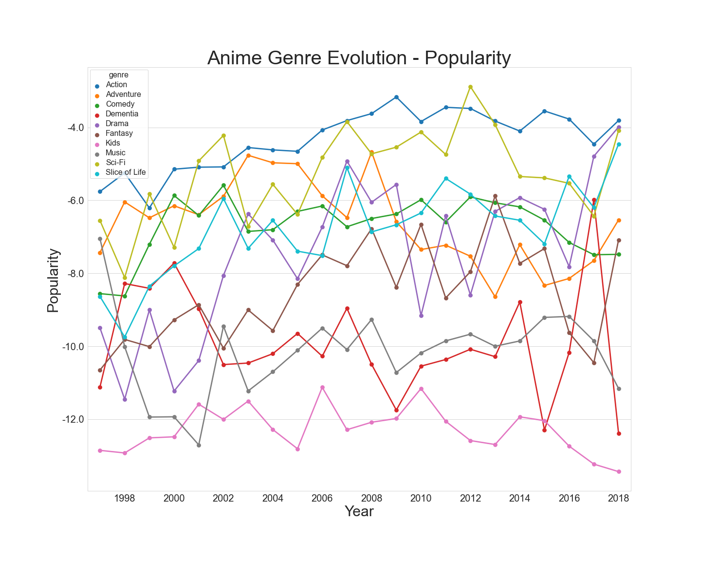

# weebythingsfornonweebs

Interpretable Anime Recommender & Trend Analyzer

## Table of contents:  
* [Summary](#summary)  
* [File Structure](#file-structure)  
* [How to run the code](#how-to-run-the-code)  
* [Third-party Modules](#third-party-modules)

## Summary:

Our recommender system has two approaches: by analyzing the correlation between the user and the anime, and by analyzing the correlation between one anime and another. To obtain the correlation between one anime and another we could first extract the features of the anime series using principal component analysis (PCA) for features like genre, producer, and rating. Next, we will use unsupervised learning like K-means to cluster the anime series with similar features. This way, for a given anime series, we could recommend similar anime series. To analyze the ranking between the user and the anime, we could extract and analyze (taking average or split into clusters) the features of the anime series the user viewed and recommend animes with similar features. Due to the interpretability of our recommender system, it can be used by consumers to find the best anime to watch according to their tastes. Further, the analysis of trends may inform anime producers and distributors as to where the industry is heading.

### Broad trends to analyze:
1. Genre evolution over time.
2. Genre vs gender with a selector for age range.
3. How are genres clustered? Does one genre necessarily imply another?

### User trends to analyze:
1. Where do certain people watch titles from? Is there a correlation? Popularity by location?
2. Viewer ages.
3. We can use the dates when an anime is watched by a user to gauge if it is still relevant after it has aired. Just a plot of when people are watching.

  

## File Structure:
**/src**  
> - a python notebook that shows how all graphs were generated.  
> - python script files used for prototyping various recommendation models, all of which use a single feature.  
> - a finalized python script file that combines all the features of the individual recommendation systems into one combined recommendation system with multiple user inputs.  
> - a python script file that cleans and filters the raw data files for building the recommendation system and data analysis.  
> - a python script file analyzes genre over time according to different metric such as average MAL score, popularity, and number of members.  

**/data_raw**  
> - raw user and anime data that was sourced from MyAnimeList and shared on Kaggle.  

**/data_cleaned_filtered**  
> - various csv files with certain features dropped. All files have no NaN or missing values.  
> - a requirements.txt file that enables the user to install all required third-party modules and libraries.  

## How to run the code:
1. Install python (version 3)
2. Install required modules/libraries (see requirements.txt)
3. Ensure you have the **data_cleaned_filtered** folder downloaded to your working directory.  
4. Run the script files. (Go to MyAnimeList.net to search for an anime and compare results.)  
5. Use Jupyter Notebooks to run **visualizations.ipynb**

## Third-party Modules:
* countryconverter
* geopandas
* matplotlib
* notebook
* numpy
* pandas
* scikit-learn
* scipy
* seaborn

